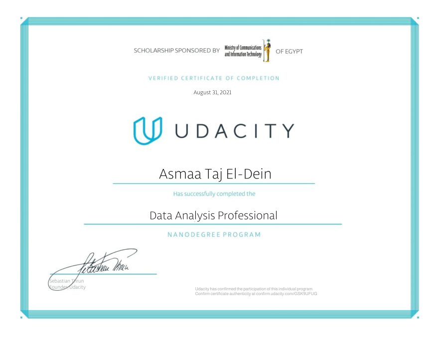

# Udacity Data Analysis Professional Nanodegree

This repo has my implementation for the projects needed to complete the Data Analysis Nanodegree.

# Projects

- [Project 1 - Explore US Bikeshare Data](#project-1---explore-us-bikeshare-data)
- [Project 2 - Investigate a Dataset](#project-2---investigate-a-dataset)

## Project 1 - Explore US Bikeshare Data

In this project, we make use of Python to explore data related to bike share systems for three major cities in the United States—Chicago, New York City, and Washington.

**To complete this project, the following software requirements apply:**

- You should have Python 3, NumPy, and pandas installed using Anaconda
- A text editor.
- A terminal application.

We learned about bike share use in Chicago, New York City, and Washington by computing a variety of descriptive statistics. In this project, we wrote code to provide the following information:

### #1 Popular times of travel (i.e., occurs most often in the start time)

- most common month
- most common day of week
- most common hour of day

### #2 Popular stations and trip

- most common start station
- most common end station
- most common trip from start to end (i.e., most frequent combination of start station and end station)

### #3 Trip duration

- total travel time
- average travel time

### #4 User info

- counts of each user type
- counts of each gender (only available for NYC and Chicago)
- earliest, most recent, most common year of birth (only available for NYC and Chicago)

### The Files

To answer these questions using Python, you need to write a Python script and the three city dataset files too:

- chicago.csv
- new_york_city.csv
- washington.csv

## Project 2 - Investigate a Dataset

In this project, we analyze a dataset and then communicate our findings about it. we use the Python libraries NumPy, pandas, and Matplotlib to make our analysis easier.

The analysis was conducted on the [No-show appointments Dataset](/Project%202%20-%20Investigate%20a%20Dataset/Database_No_show_appointments/noshowappointments-kagglev2-may-2016.csv) (original source on [kaggle](https://www.kaggle.com/datasets/joniarroba/noshowappointments))

**To complete this project, the following software requirements apply:**

- Python
- pandas
- NumPy
- Matplotlib
- csv
